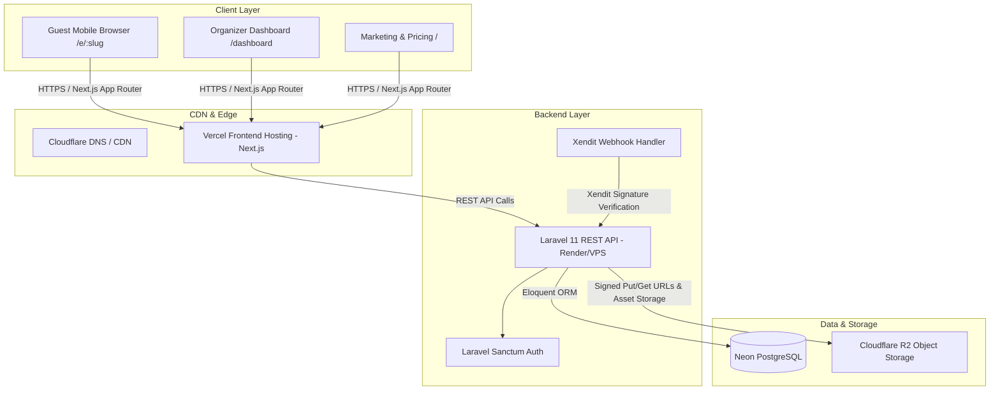
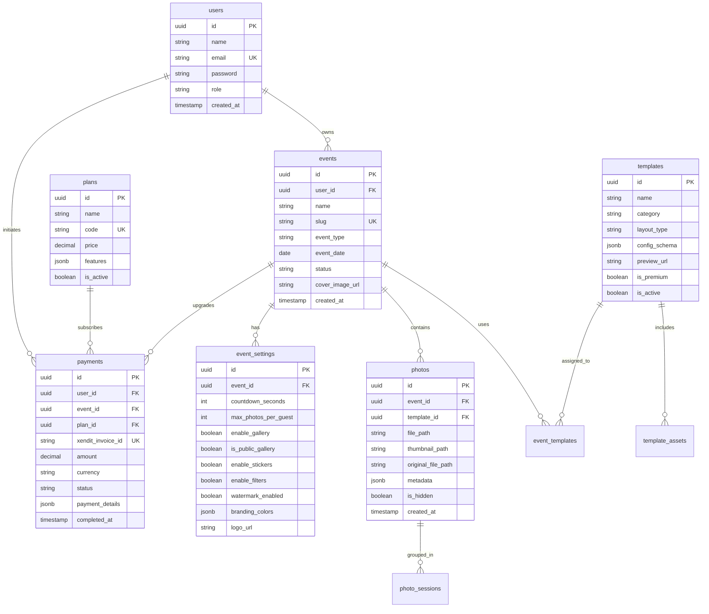
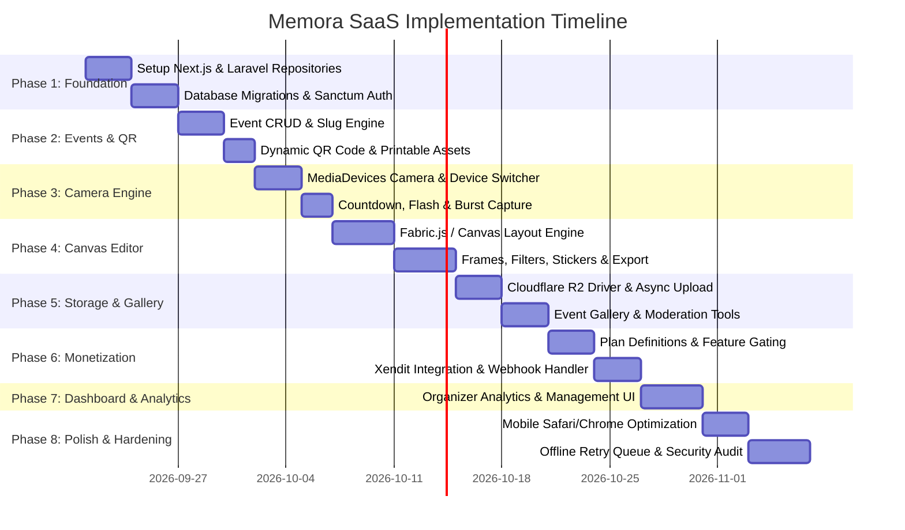

# Memora — Web Photobooth SaaS Implementation Plan

> **Note:** This plan provides a structured, phased, and comprehensive technical roadmap to build and launch the **Memora** Web Photobooth SaaS platform based on [project.md](file:///c:/Users/basco/Devs/memora/docs/project.md).

---

## 1. Executive Summary & System Vision

**Memora** is a browser-first photobooth SaaS designed for weddings, birthdays, graduations, corporate gatherings, and parties. The core premise eliminates app store downloads for guests while providing organizers with a customizable event hub and monetization layer:

```text
Organizer creates Event 
       ↓
Dynamic QR Code generated 
       ↓
Guest scans QR (Mobile Browser) 
       ↓
MediaDevices Camera Access 
       ↓
Photo Capture & Countdown 
       ↓
In-Browser Canvas Editor (Frames, Filters, Stickers, Strips) 
       ↓
Instant Download & Async Cloud Upload (Cloudflare R2) 
       ↓
Live Event Gallery & Organizer Dashboard
```

---

## 2. Architecture & System Flow

### High-Level Architecture



### Repository Structure Recommendation
A clean monorepo or adjacent repository structure:
```text
memora/
├── docs/
│   ├── project.md
│   └── implementation_plan.md
├── frontend/                # Next.js 14+ (App Router, TypeScript, Tailwind, shadcn/ui)
│   ├── src/
│   │   ├── app/             # Route handlers & pages
│   │   │   ├── (auth)/      # /login, /register, /forgot-password
│   │   │   ├── (marketing)/ # Landing page, pricing, features
│   │   │   ├── dashboard/   # Organizer admin panel
│   │   │   └── e/[slug]/    # Guest photobooth experience (mobile-first)
│   │   ├── components/      # UI primitives (shadcn) & global layouts
│   │   ├── features/        # Domain-driven feature modules
│   │   │   ├── camera/      # getUserMedia hook, stream controls, countdown
│   │   │   ├── editor/      # Canvas/Fabric.js rendering, frames, stickers, filters
│   │   │   ├── events/      # Event creation wizard, QR code display
│   │   │   ├── gallery/     # Live gallery grid, lightbox, moderation
│   │   │   └── payments/    # Pricing tables, checkout modal, upgrade flow
│   │   ├── hooks/           # Custom React hooks
│   │   ├── lib/             # API client, canvas utils, helpers
│   │   └── types/           # TypeScript interfaces & DTOs
└── backend/                 # Laravel 11 API (PHP 8.2+)
    ├── app/
    │   ├── Http/
    │   │   ├── Controllers/Api/ # Auth, Event, Photo, Template, Payment controllers
    │   │   ├── Requests/        # Form validation rules
    │   │   └── Resources/       # Eloquent API JSON resources
    │   ├── Models/              # User, Event, Photo, Template, Payment, Plan
    │   ├── Services/            # CloudflareR2Service, XenditService, FeatureGateService
    │   └── Policies/            # Authorization policies
    ├── config/                  # filesystems.php (R2), xendit.php, sanctum.php
    ├── database/
    │   ├── migrations/          # PostgreSQL migrations
    │   └── seeders/             # Plans, default templates, system roles
    └── routes/
        └── api.php              # Versioned REST endpoints
```

---

## 3. Technology Stack & Key Dependencies

| Domain | Technology | Purpose & Selection Rationale |
| :--- | :--- | :--- |
| **Frontend Framework** | Next.js (App Router, React 19/18, TypeScript) | Server-side rendering for marketing pages, fast client transitions, native SEO |
| **Styling & Components**| Tailwind CSS + shadcn/ui + Lucide Icons | Responsive modern design system, rapid accessible UI primitives |
| **Animation** | Framer Motion | Smooth micro-animations, transitions, camera countdown triggers |
| **In-Browser Canvas** | HTML5 Canvas API / Fabric.js | Client-side photo processing, cropping, strip composition, watermarking |
| **Camera Access** | Native `navigator.mediaDevices.getUserMedia` | Zero-install browser hardware access with rear/front camera switching |
| **QR Code** | `qrcode.react` & `html-to-image` | Instant dynamic event QR generation and printable export |
| **Backend Framework** | Laravel 11 (PHP 8.2+) | Robust ecosystem, Sanctum auth, Eloquent ORM, built-in queues & policies |
| **Authentication** | Laravel Sanctum | Token/cookie-based SPA authentication for organizers |
| **Database** | Neon Serverless PostgreSQL | Scalable relational DB with connection pooling and branching support |
| **File Storage** | Cloudflare R2 via AWS S3 Flysystem driver | High throughput S3-compatible storage with **$0 egress fees** |
| **Payment Gateway** | Xendit API & Webhooks | Multi-channel payment processing (Cards, E-Wallets, QRIS, Bank Transfer) |
| **Realtime (Future)** | Laravel Reverb / WebSockets | Real-time photo stream in live event gallery (Phase 8+) |

---

## 4. Database Schema Design (PostgreSQL)



---

## 5. REST API Specifications

### 5.1 Authentication (`/api/auth`)
- `POST /api/auth/register` — Creates user account; returns token + user payload.
- `POST /api/auth/login` — Authenticates credentials; returns Sanctum token.
- `POST /api/auth/logout` — Revokes active Sanctum token.
- `GET  /api/user` — Returns authenticated user profile, active plan, and usage stats.

### 5.2 Events & Settings (`/api/events`)
- `GET    /api/events` — Paginated list of events owned by authenticated organizer.
- `POST   /api/events` — Create new event (validates slug uniqueness, default settings).
- `GET    /api/events/{slug}` — Retrieve event details and public settings for photobooth guest.
- `PUT    /api/events/{id}` — Update event info (name, date, status).
- `DELETE /api/events/{id}` — Soft delete event and mark associated photos.
- `GET    /api/events/{id}/settings` — Retrieve photobooth configuration.
- `PUT    /api/events/{id}/settings` — Update branding, limits, watermark, countdown.

### 5.3 Templates (`/api/templates`)
- `GET  /api/templates` — List all active templates (filtered by category/premium flag).
- `GET  /api/events/{id}/templates` — Templates available for a specific event based on plan.

### 5.4 Photos & Uploads (`/api/events/{slug}/photos`)
- `POST /api/events/{slug}/photos` — Accepts composite image (WebP/JPEG) + metadata (dimensions, layout). Stores to Cloudflare R2, creates `photos` record.
- `GET  /api/events/{slug}/gallery` — Public/private paginated photo stream for the event.
- `PATCH /api/photos/{id}/visibility` — Organizer moderation: toggle photo hide/show.
- `DELETE /api/photos/{id}` — Organizer action: permanently remove photo from R2 and DB.

### 5.5 Payments & Webhooks (`/api/payments`)
- `GET  /api/plans` — Fetch active plans and feature limits.
- `POST /api/payments/checkout` — Initiates Xendit Invoice session for event upgrade. Returns checkout URL.
- `POST /api/payments/webhook` — Secure webhook endpoint. Verifies `x-callback-token`, validates payment status, unlocks premium features on the event.

---

## 6. Phased Implementation Roadmap



---

### Phase 1: Foundation & Core Infrastructure
**Goal:** Initialize full-stack monorepo, database connections, design tokens, and authentication.

#### Task 1.1: Frontend Project Setup
- **Directory:** `frontend/`
- **Actions:**
  - Initialize Next.js 14+ App Router project with TypeScript, Tailwind CSS, and ESLint.
  - Install and initialize `shadcn/ui` with custom color palette (vibrant, modern dark/light mode).
  - Install dependencies: `lucide-react`, `framer-motion`, `axios`, `clsx`, `tailwind-merge`.
  - Configure root layout, fonts (Outfit/Inter), and global responsive container utilities.
- **Verification:** Run `npm run dev` and confirm clean hydration with zero console warnings.

#### Task 1.2: Backend API Setup & Database Migrations
- **Directory:** `backend/`
- **Actions:**
  - Initialize Laravel 11 application with PHP 8.2+.
  - Configure `.env` with Neon PostgreSQL connection string.
  - Install Laravel Sanctum: `composer require laravel/sanctum`.
  - Create migrations for `users`, `events`, `event_settings`, `plans`, `templates`, `photos`, and `payments`.
  - Implement Sanctum auth controllers: `AuthController.php` (login, register, logout, me).
- **Verification:** Run `php artisan migrate --seed` and test authentication endpoints via Postman/cURL.

---

### Phase 2: Event Management & QR Code Generation
**Goal:** Enable organizers to create events, configure booth behavior, and generate QR access links.

#### Task 2.1: Event Service & Controllers (Backend)
- **Files to Create:**
  - `app/Http/Controllers/Api/EventController.php`
  - `app/Http/Requests/CreateEventRequest.php`
  - `app/Services/EventService.php`
- **Logic:**
  - Auto-generate URL-friendly unique slug from event name (e.g. `juan-maria-wedding-2026`).
  - Create default `event_settings` record upon event creation.
  - Ownership check via Laravel Policy: only event creator can edit or delete.
- **Verification:** PHPUnit feature tests for Event CRUD and authorization boundaries.

#### Task 2.2: Event Creation Wizard & QR Presentation (Frontend)
- **Files to Create:**
  - `frontend/src/features/events/components/EventWizard.tsx`
  - `frontend/src/features/events/components/QrShareCard.tsx`
  - `frontend/src/app/dashboard/events/create/page.tsx`
- **Logic:**
  - Multi-step form: Basic Info → Branding (Logo, Colors) → Photobooth Rules (Countdown, Watermark) → Publish.
  - Integrate `qrcode.react` to render SVG/Canvas QR codes.
  - Provide "Download PNG", "Copy Event Link", and "Print QR Sign" actions.
- **Verification:** Create event in UI, scan generated QR on physical smartphone, verify browser routes to `/e/[slug]`.

---

### Phase 3: Guest Photobooth & Native Camera Engine
**Goal:** Build a zero-friction mobile-first photobooth interface with device camera integration.

#### Task 3.1: Hardware Permission & Stream Controller
- **Files to Create:**
  - `frontend/src/features/camera/hooks/useCamera.ts`
  - `frontend/src/features/camera/components/CameraViewfinder.tsx`
  - `frontend/src/features/camera/components/PermissionModal.tsx`
- **Logic:**
  - Request `navigator.mediaDevices.getUserMedia({ video: { facingMode: 'user', width: { ideal: 1920 }, height: { ideal: 1080 } } })`.
  - Graceful handling for: `NotAllowedError` (Permission denied), `NotFoundError` (No camera), `NotReadableError` (Camera in use).
  - Front/back camera toggle button (using `facingMode: { exact: 'environment' }` fallback).
- **Verification:** Test on iOS Safari, Android Chrome, and Desktop Chrome with permission prompts.

#### Task 3.2: Capture Sequence & Countdown
- **Files to Create:**
  - `frontend/src/features/camera/components/CountdownOverlay.tsx`
  - `frontend/src/features/camera/components/CaptureControls.tsx`
- **Logic:**
  - Configurable countdown timer (3s, 5s, 10s) with Framer Motion number animations.
  - Flash effect: CSS white overlay flash animation upon frame capture.
  - Capture frame by drawing `<video>` stream onto hidden high-res `<canvas>`.
  - Provide "Retake" and "Proceed to Edit" states.
- **Verification:** Capture photo on mobile device, confirm captured frame preserves aspect ratio without distortion.

---

### Phase 4: In-Browser Photo Editor & Composite Engine
**Goal:** Client-side photo customization (frames, multi-photo strips, filters, stickers, text).

#### Task 4.1: Canvas Processing Engine
- **Files to Create:**
  - `frontend/src/features/editor/lib/canvasEngine.ts`
  - `frontend/src/features/editor/components/PhotoEditor.tsx`
  - `frontend/src/features/editor/components/StripComposer.tsx`
- **Capabilities:**
  - **Layouts:** Single 4:3 / 1:1, Polaroid frame, 2-photo strip, 3-photo vertical strip, 4-photo 2x2 grid.
  - **Color Filters:** CSS canvas filter matrix (B&W, Warm Vintage, Sepia, High Contrast, Vibrant).
  - **Branding & Overlays:** Event logo insertion, custom date/names overlay at bottom margin.
  - **Watermark Engine:** Renders dynamic "Memora Free" watermark if event does not have active Premium tier.
- **Verification:** Generate single photo and 3-photo strip; export to high-resolution JPEG/WebP (2000px+ height).

#### Task 4.2: Client-Side Export & Instant Download
- **Files to Create:**
  - `frontend/src/features/editor/components/ExportModal.tsx`
  - `frontend/src/lib/downloadHelper.ts`
- **Logic:**
  - Convert canvas to `Blob` (`image/jpeg` with quality 0.92).
  - Instant trigger for client download (`<a download="memora-[event]-[timestamp].jpg">`).
  - Native Web Share API trigger (`navigator.share`) on supported mobile devices.
- **Verification:** Verify download speed is instantaneous (<500ms) without waiting for server response.

---

### Phase 5: Storage Architecture & Cloud Event Gallery
**Goal:** Seamless background upload to Cloudflare R2 and responsive event gallery with organizer moderation.

#### Task 5.1: Cloudflare R2 Integration (Backend)
- **Files to Create:**
  - `backend/app/Services/CloudflareR2Service.php`
  - `backend/app/Http/Controllers/Api/PhotoUploadController.php`
  - `backend/config/filesystems.php` (configure R2 S3 driver)
- **Logic:**
  - Accept composite photo from guest client.
  - Generate clean hash key: `events/{event_id}/photos/{year}/{uuid}.webp`.
  - Create thumbnail (400px width) and store in `events/{event_id}/thumbs/{uuid}.webp`.
  - Insert record into `photos` table with dimensions, file size, and template ID.
- **Verification:** Upload test image, verify presence in Cloudflare R2 bucket and database row.

#### Task 5.2: Public & Private Event Gallery (Frontend)
- **Files to Create:**
  - `frontend/src/features/gallery/components/GalleryGrid.tsx`
  - `frontend/src/features/gallery/components/PhotoLightbox.tsx`
  - `frontend/src/app/e/[slug]/gallery/page.tsx`
  - `frontend/src/app/dashboard/events/[id]/gallery/page.tsx`
- **Logic:**
  - Responsive masonry grid with lazy-loaded thumbnails.
  - Full-screen lightbox with download and share options.
  - Organizer moderation: "Hide Photo" or "Delete Photo" buttons (authenticated).
- **Verification:** Upload 10 photos, inspect masonry grid layout across mobile (2 columns) and desktop (4 columns).

---

### Phase 6: Monetization, Plans & Xendit Payment Gateway
**Goal:** Feature gating and automated checkout for event upgrades via Xendit webhook verification.

#### Task 6.1: Feature Gating Service
- **Files to Create:**
  - `backend/app/Services/FeatureGateService.php`
  - `backend/app/Http/Middleware/CheckFeatureAccess.php`
- **Rules:**
  - `watermark_removal`: Requires `event_premium` or `business` tier.
  - `hd_downloads`: Requires `event_premium` or `business` tier.
  - `premium_templates`: Requires `event_premium` or `business` tier.
  - `custom_branding`: Requires `event_premium` or `business` tier.
- **Verification:** Unit tests verifying access denial for free events and access approval for paid events.

#### Task 6.2: Xendit Checkout & Webhook Handler
- **Files to Create:**
  - `backend/app/Services/XenditService.php`
  - `backend/app/Http/Controllers/Api/PaymentWebhookController.php`
  - `frontend/src/features/payments/components/UpgradeModal.tsx`
- **Workflow:**
  - Organizer clicks "Upgrade Event" → Backend calls Xendit Invoice API (`/v2/invoices`).
  - Frontend redirects to Xendit Hosted Checkout or opens payment modal.
  - Xendit dispatches webhook `POST /api/payments/webhook` on status `PAID`.
  - Backend verifies `x-callback-token` header against `XENDIT_CALLBACK_TOKEN` secret.
  - Updates `payments` table and toggles `events.is_premium = true`.
- **Security Check:** Zero trust on frontend success redirects. Unlocks occur **strictly** via verified backend webhook.

---

### Phase 7: Organizer Dashboard & Analytics
**Goal:** Dedicated hub for organizers to monitor event activity, photos taken, and downloads.

#### Task 7.1: Dashboard UI & Event Analytics
- **Files to Create:**
  - `frontend/src/app/dashboard/page.tsx`
  - `frontend/src/features/dashboard/components/StatsOverview.tsx`
  - `frontend/src/features/dashboard/components/RecentEventsTable.tsx`
- **Metrics Tracked:**
  - Total active events vs completed events.
  - Total photos captured across events.
  - Storage consumption and quota indicator.
  - Quick action to copy QR code, open live booth, or view gallery.
- **Verification:** Validate metrics accuracy against database records.

---

### Phase 8: Offline Resilience, Error Handling & Mobile Polish
**Goal:** Ensure fault tolerance during spotty event WiFi and maximize mobile usability.

#### Task 8.1: Mobile Polish & Viewport Hardening
- **Actions:**
  - Prevent pinch-to-zoom on photobooth interface (`viewport-fit=cover`, `touch-action: manipulation`).
  - Prevent auto-locking during camera session using Screen Wake Lock API (`navigator.wakeLock.request('screen')`).
  - Audit touch target sizes (all primary buttons minimum 48px × 48px).

#### Task 8.2: Offline / Poor Connection Queue
- **Files to Create:**
  - `frontend/src/features/camera/lib/offlineQueue.ts`
- **Logic:**
  - When guest completes photo, store blob in `IndexedDB` immediately.
  - Trigger client download without waiting for cloud sync.
  - Background worker attempts upload to backend. If offline, queues until connection restored (`window.addEventListener('online')`).
- **Verification:** Simulate offline mode in Chrome DevTools; capture photo, verify it downloads locally, and uploads once network is re-enabled.

---

### Phase 9: Production Deployment & Security Hardening
**Goal:** Deploy production frontend, backend, database, and storage with zero secret exposure.

#### Task 9.1: Security Checklist
- [ ] CORS configured to allow only verified frontend domains.
- [ ] Rate limiting on `/api/events/{slug}/photos` (prevent spam submissions).
- [ ] File validation: strictly `image/jpeg`, `image/png`, `image/webp` with maximum 15MB payload.
- [ ] Environment variables validated: `APP_KEY`, `DATABASE_URL`, `R2_SECRET_ACCESS_KEY`, `XENDIT_SECRET_KEY` never checked into git.
- [ ] Cloudflare R2 bucket set to private access with pre-signed upload/download or API proxy.

#### Task 9.2: Deployment Pipeline
- **Frontend:** Vercel deployment connected to `main` branch.
- **Backend:** Render / Laravel Cloud / VPS with PHP 8.2 FPM + Nginx.
- **Database:** Neon PostgreSQL with connection pooling enabled.
- **CDN:** Cloudflare DNS with SSL/TLS Full (Strict) enabled.

---

## 7. Verification & Testing Strategy

### Automated Testing Suite
- **Backend Unit & Feature Tests (PHPUnit / Pest):**
  ```bash
  php artisan test --filter=EventTest
  php artisan test --filter=PhotoUploadTest
  php artisan test --filter=PaymentWebhookTest
  ```
- **Frontend Component & Hook Tests (Vitest / React Testing Library):**
  ```bash
  npm run test:unit
  ```
- **End-to-End Browser Tests (Playwright):**
  - Scenario 1: Guest opens `/e/demo-event`, grants simulated camera permission, captures frame, downloads photo.
  - Scenario 2: Organizer creates event in dashboard, verifies QR code generation.
  - Scenario 3: Webhook fires payment completion, verifies premium features unlock.

### Manual Verification Checklist
1. **Camera Compatibility:** Test on physical iPhone (Safari iOS 17+) and Android (Chrome 120+).
2. **Orientation Changes:** Test portrait to landscape switching during camera preview.
3. **Download Verification:** Verify downloaded image resolution and frame alignment.
4. **Watermark Enforcement:** Confirm watermark is present on free tier and absent on premium tier.

---

## 8. Next Steps & Execution

To begin executing this plan:
1. **Phase 1 Execution:** Initialize the frontend and backend project skeletons, setup database migrations and authentication.
2. **Phase 2 & 3 Execution:** Implement event creation and the mobile-first camera engine.
3. **Continuous Review:** Review each phase upon completion against the defined verification steps.
